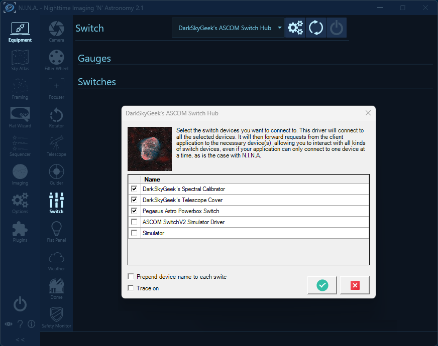
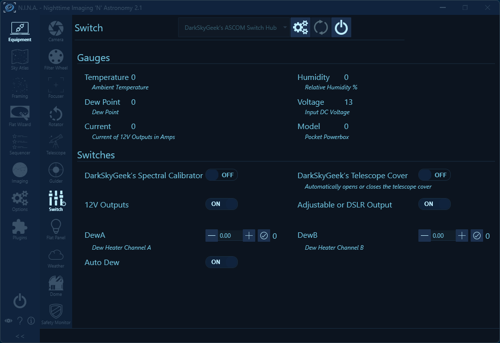

# ASCOM Switch Hub

- [Introduction](#introduction)
- [Screenshots](#screenshots)
- [Downloading And Installing The Driver](#downloading-and-installing-the-driver)
- [Compiling The Driver (For Developers Only)](#compiling-the-driver-for-developers-only)

## Introduction

For each device type (camera, focuser, telescope mount, etc.), [N.I.N.A.](https://nighttime-imaging.eu/) can only connect to a single device. This is usually not a problem, and this simple design fulfills the 99% use case. Occasionally, more advanced use cases require multiple devices of the same type to be connected. For example, I have two focusers, my main imaging train focuser (a ZWO EAF), and an [OAG focuser](https://github.com/jlecomte/ascom-oag-focuser). However, those use cases are generally handled by simultaneously running multiple independent instances of N.I.N.A. Unfortunately, switches are a bigger issue because they are such common devices that it is not uncommon to have multiple, and being able to connect to all the switch devices within the same instance of N.I.N.A. is required to have them participate in an imaging sequence. This ASCOM switch driver, dubbed an "ASCOM Switch Hub", allows you to indirectly connect to multiple switch devices.

## Screenshots

To select the switch devices to connect to, open the settings dialog:



Upon connecting the ASCOM Switch Hub, you should be able to see all the switches for all the selected devices:



## Downloading And Installing The Driver

**Step 1:** Download the driver from the [releases page](https://github.com/jlecomte/ascom-switch-hub/releases), and place the file `ASCOM.DarkSkyGeek.SwitchHub.dll` somewhere on your system (example: `C:\Users\julien\ascom-switch-hub\`).

**Step 2:** Open a command prompt, but make sure you run it **as an administrator**!

**Step 3:** Then, proceed with the installation of the driver using `RegAsm.exe`, a utility that should already be present on your system (it comes with the .NET framework). Just don't forget to use the 64 bit version, and to pass the `/tlb /codebase` flags. Here is what it looked like on my imaging mini computer:

```
> cd C:\Users\julien\ascom-switch-hub\
> C:\Windows\Microsoft.NET\Framework64\v4.0.30319\RegAsm.exe /tlb /codebase ASCOM.DarkSkyGeek.SwitchHub.dll
Microsoft .NET Framework Assembly Registration Utility version 4.8.4161.0
for Microsoft .NET Framework version 4.8.4161.0
Copyright (C) Microsoft Corporation.  All rights reserved.

Types registered successfully
```

**Note:** The output may be more verbose than the above. As long as it says `Types registered successfully`, you are good to go!

**Note:** During registration, you will see a warning that the assembly is unsigned. This is normal as I did not bother going through the pain of signing the assembly, so you will just have to trust that you are registering the DLL that I built and uploaded to GitHub. And if you don't trust me / GitHub, you can build the DLL yourself using Visual Studio.

**Note:** Once the driver has been installed, make sure you do _not_ delete or move the `ASCOM.DarkSkyGeek.SwitchHub.dll` file, or things will not work! (if you do move it, you will need to register it again in its new location)

**Step 4:** Start (or restart, if it was already running) N.I.N.A. (or whatever application you use to control your equipment).

## Compiling The Driver (For Developers Only)

Open Microsoft Visual Studio as an administrator (right-click on the Microsoft Visual Studio shortcut, and select "Run as administrator"). This is required because when building the code, by default, Microsoft Visual Studio will register the compiled COM components, and this operation requires special privileges (Note: This is something you can disable in the project settings...) Then, open the solution (`ASCOM.DarkSkyGeek.SwitchHub.sln`), change the solution configuration to `Release` (in the toolbar), open the `Build` menu, and click on `Build Solution`. As long as you have properly installed all the required dependencies, the build should succeed and the ASCOM driver will be registered on your system. The binary file generated will be `bin\Release\ASCOM.DarkSkyGeek.SwitchHub.dll`. You may also download this file from the [Releases page](https://github.com/jlecomte/ascom-switch-hub/releases).
