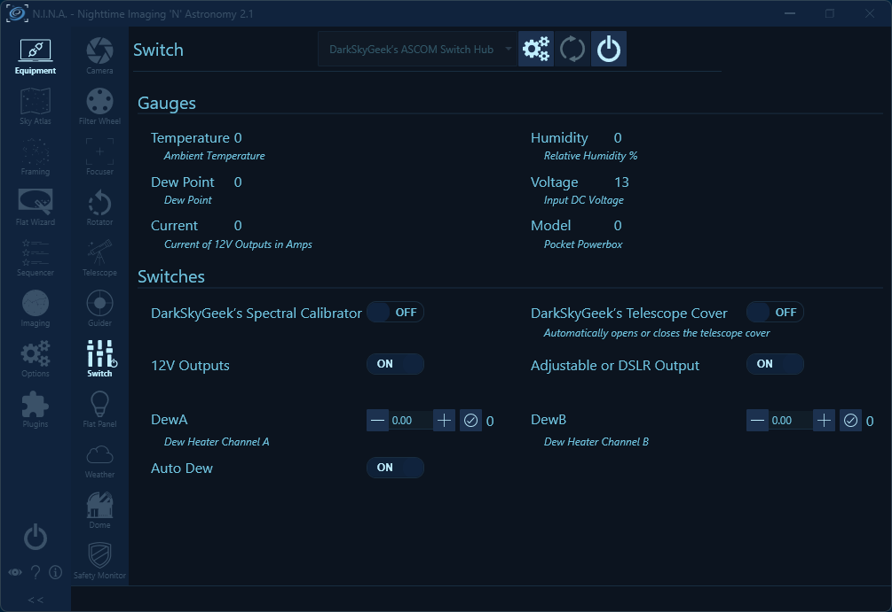
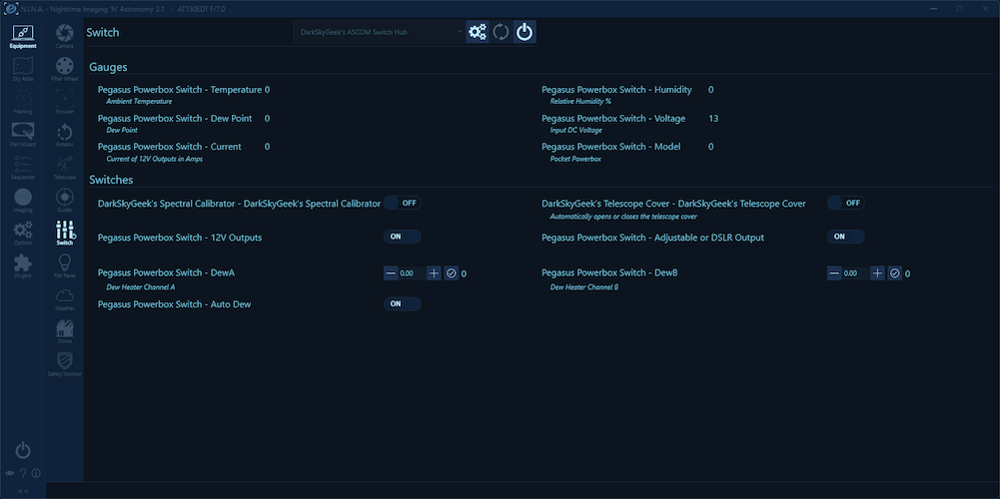

# ASCOM Switch Hub

- [Introduction](#introduction)
- [Screenshots](#screenshots)
- [Downloading And Installing The Driver](#downloading-and-installing-the-driver)
- [Compiling The Driver (For Developers Only)](#compiling-the-driver-for-developers-only)
- [Frequently Asked Questions (FAQ)](#frequently-asked-questions-faq)

## Introduction

For each device type (camera, focuser, telescope mount, etc.), [N.I.N.A.](https://nighttime-imaging.eu/) can only connect to a single device. This is usually not a problem, and this simple design fulfills the 99% use case. Occasionally, more advanced use cases require multiple devices of the same type to be connected. For example, I have two focusers, my main imaging train focuser (a ZWO EAF), and an [OAG focuser](https://github.com/jlecomte/ascom-oag-focuser). However, those use cases are generally handled by simultaneously running multiple independent instances of N.I.N.A. Unfortunately, switches are a bigger issue because they are such common devices that it is not uncommon to have multiple, and being able to connect to all the switch devices within the same instance of N.I.N.A. is required to have them participate in an imaging sequence. This ASCOM switch driver, dubbed an "ASCOM Switch Hub", allows you to indirectly connect to multiple switch devices.

## Screenshots

To select the switch devices to connect to, open the settings dialog:

Upon connecting the ASCOM Switch Hub, you should be able to see all the switches for all the selected devices:

If you happen to have to switches or gauges named exactly the same way, you can enable the option to prepend the device name to each switch. That option is disabled by default because few people will encounter that issue, and with that option, the N.I.N.A. UI would look a little bit "busy":

## Downloading And Installing The Driver

Starting with version `1.1.1`, you can install the ASCOM driver by running the executable setup file that you will find in the [releases page](https://github.com/jlecomte/ascom-switch-hub/releases). By default, it places files under `C:\Program Files (x86)\Dark Sky Geek\OAG Focuser ASCOM Driver`.

## Compiling The Driver (For Developers Only)

Open Microsoft Visual Studio as an administrator (right-click on the Microsoft Visual Studio shortcut, and select "Run as administrator"). This is required because when building the code, by default, Microsoft Visual Studio will register the compiled COM components, and this operation requires special privileges (Note: This is something you can disable in the project settings...) Then, open the solution (`ASCOM_Driver\ascom-switch-hub.sln`), change the solution configuration to `Release` (in the toolbar), open the `Build` menu, and click on `Build Solution`. As long as you have properly installed all the required dependencies, the build should succeed and the ASCOM driver will be registered on your system. The binary file generated will be `ASCOM_Driver\bin\Release\ASCOM.DarkSkyGeek.SwitchHub.dll`. You may also download this file from the [Releases page](https://github.com/jlecomte/ascom-switch-hub/releases).

## Frequently Asked Questions (FAQ)

**Question:** My antivirus identifies your setup executable file as a malware (some kind of Trojan)

**Answer:** This is a false detection, extremely common with installers created with [Inno Setup](https://jrsoftware.org/isinfo.php) because virus and malware authors also use Inno Setup to distribute their malicious payload... Anyway, there isn't much I can do about this, short of signing the executable. Unfortunately, that would require a code signing certificate, which costs money. So, even though the executable I uploaded to GitHub is perfectly safe, use at your own risk!
